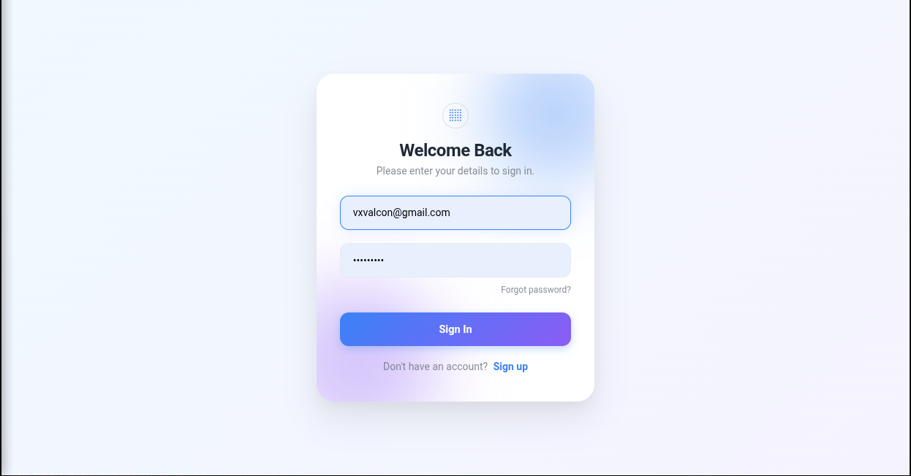
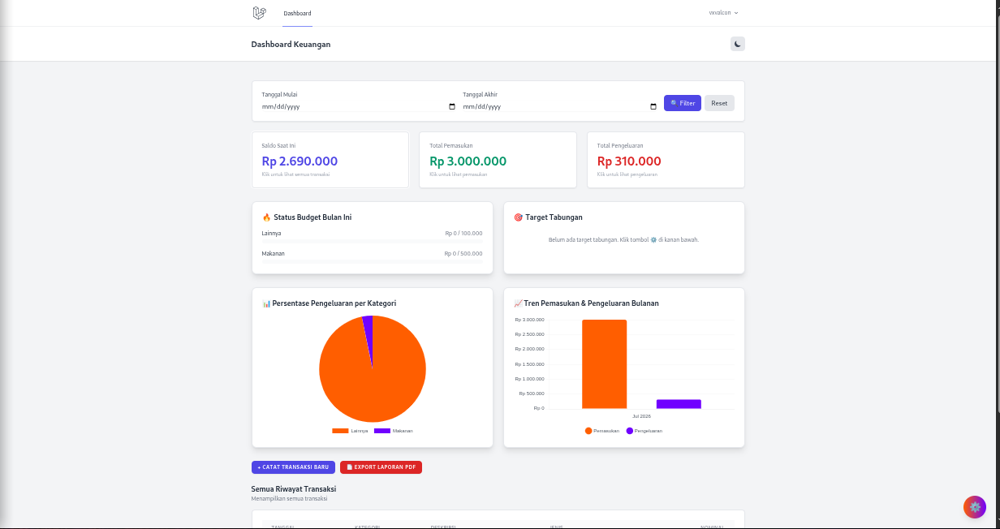
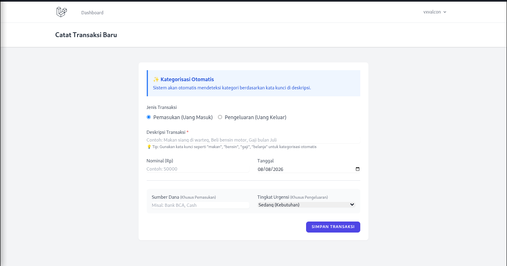
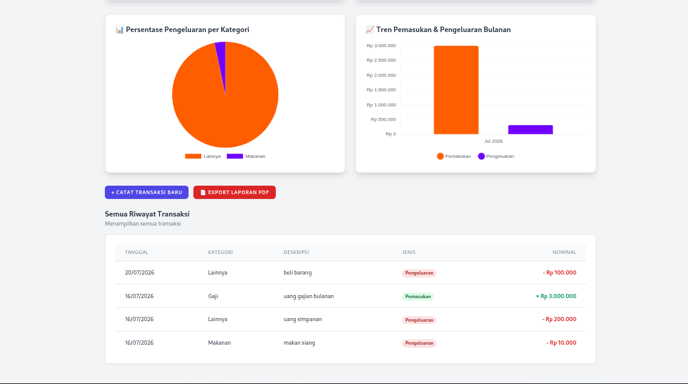
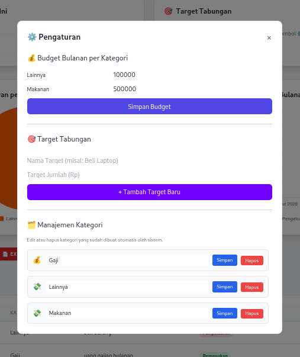
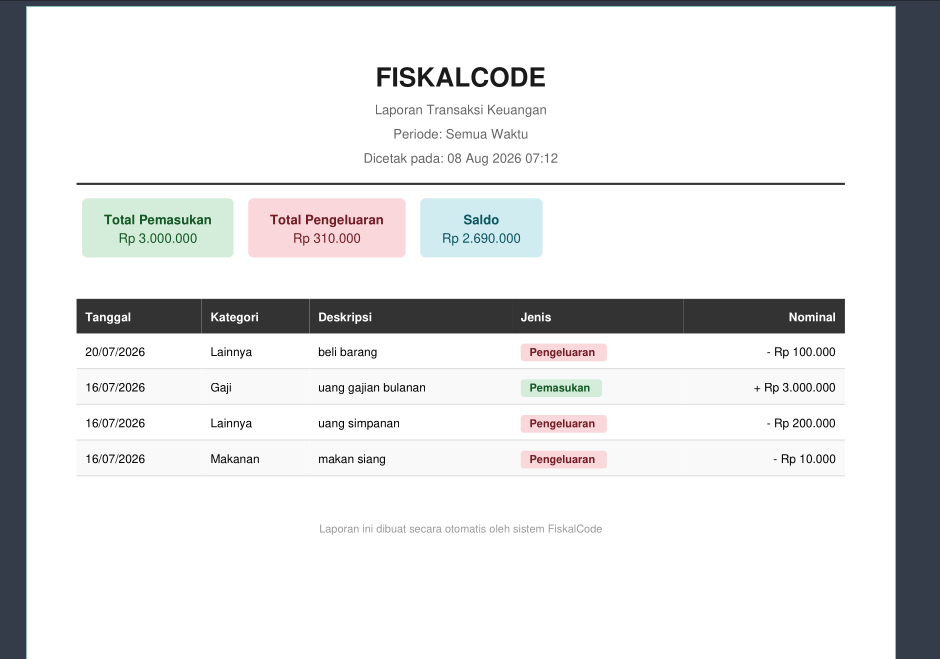

#  FiskalCode - Aplikasi Manajemen Keuangan Pribadi

<div align="center">


**Aplikasi Web Modern untuk Pengelolaan Keuangan Pribadi yang Efisien dan Terstruktur**

[📖 Dokumentasi](#-dokumentasi) • [🚀 Demo](#-demo) • [📦 Instalasi](#-instalasi) • [👨‍ Author](#-author)

</div>


---

## 📖 Tentang Proyek

**FiskalCode** adalah solusi aplikasi web modern yang dirancang untuk membantu individu dalam mengelola keuangan pribadi secara efektif dan efisien. Aplikasi ini dikembangkan menggunakan framework **Laravel 11** dengan pendekatan **Object-Oriented Programming (OOP)** yang kuat.

### 🎯 Latar Belakang
Dalam era digital saat ini, pengelolaan keuangan yang baik merupakan kunci untuk mencapai stabilitas finansial. Namun, banyak orang kesulitan untuk:
- Mencatat pemasukan dan pengeluaran secara konsisten
- Memantau budget per kategori
- Menetapkan dan mencapai target tabungan
- Menganalisis pola pengeluaran

FiskalCode hadir untuk menjawab tantangan tersebut dengan menyediakan platform yang user-friendly, fitur lengkap, dan visualisasi data yang interaktif.

### 🎓 Tujuan Akademis
Proyek ini dikembangkan sebagai bagian dari **Ujian Akhir Semester (UAS)** mata kuliah **Pemrograman Berorientasi Objek (PBO)** dengan tujuan:
1. Mengimplementasikan konsep OOP (Encapsulation, Inheritance, Polymorphism) dalam framework Laravel
2. Membangun aplikasi web full-stack yang fungsional
3. Menerapkan best practices dalam pengembangan software
4. Membuat sistem yang scalable dan maintainable

---

## ✨ Fitur Utama

### 🔐 **Autentikasi & Keamanan**
- ✅ Registrasi akun pengguna baru
- ✅ Login dengan email dan password (bcrypt encryption)
- ✅ Session management
- ✅ Middleware protection untuk halaman privat
- ✅ CSRF protection

###  **Manajemen Transaksi**
- 📝 Pencatatan transaksi pemasukan dan pengeluaran
- 🏷️ Kategorisasi transaksi otomatis dan manual
- 📅 Filter transaksi berdasarkan tanggal
- ✏️ Edit dan hapus transaksi
- 📊 Riwayat transaksi lengkap dengan pagination

### 📈 **Dashboard Interaktif**
- 💰 Total pemasukan, pengeluaran, dan saldo
- 📊 Visualisasi data dengan Chart.js:
  - **Pie Chart**: Distribusi pengeluaran per kategori
  - **Bar Chart**: Tren pemasukan vs pengeluaran bulanan
  - **Line Chart**: Perkembangan saldo dari waktu ke waktu
-  Ringkasan transaksi terbaru

###  **Budget Management**
- 💵 Set budget bulanan per kategori
- 📊 Progress bar visual untuk monitoring
- ⚠️ Notifikasi otomatis:
  - **Warning** (kuning): Penggunaan > 80% budget
  - **Danger** (merah): Penggunaan > 100% budget
- 📈 Analisis efisiensi pengeluaran

###  **Target Tabungan**
- 🎯 Tetapkan target tabungan dengan deadline
-  Monitoring progres dalam persentase
-  Visualisasi progress bar yang menarik
-  Catatan untuk setiap target

### 📄 **Laporan & Export**
- 📥 Export laporan transaksi ke format PDF
- 📅 Filter laporan berdasarkan periode
- 📊 Statistik ringkas dalam laporan
- 🖨️ Siap cetak untuk arsip

### 🎨 **User Interface**
- 🌗 **Dark/Light Mode**: Toggle tema yang nyaman
-  **Responsive Design**: Optimal di desktop, tablet, dan mobile
- 🎭 UI/UX modern dengan Tailwind CSS
- ⚡ Loading cepat dan smooth transitions

---

## 🛠️ Teknologi yang Digunakan

### **Backend**
| Teknologi | Versi | Deskripsi |
|-----------|-------|-----------|
| **Laravel** | 11.x | PHP Framework dengan arsitektur MVC |
| **PHP** | 8.2+ | Bahasa pemrograman server-side |
| **SQLite** | 3.x | Database relasional ringan |
| **Eloquent ORM** | Latest | Object-Relational Mapping Laravel |

### **Frontend**
| Teknologi | Versi | Deskripsi |
|-----------|-------|-----------|
| **Blade** | Latest | Templating engine Laravel |
| **Tailwind CSS** | 3.4 | Utility-first CSS framework |
| **Chart.js** | 4.4 | Library visualisasi data |
| **JavaScript** | ES6+ | Interaktivitas frontend |
| **Font Awesome** | 6.x | Icon library |

### **Tools & Deployment**
| Tools | Fungsi |
|-------|--------|
| **Git & GitHub** | Version control |
| **Composer** | Dependency manager PHP |
| **Ngrok** | Tunneling untuk demo online |
| **VS Code** | Code editor |

---

## 📊 Analisis & Perancangan Sistem (APS)

### 1. Kebutuhan Sistem
*   **Fungsional:** CRUD Transaksi, Dashboard Grafik, Budget Tracking, Export PDF.
*   **Non-Fungsional:** Responsif, Password ter-hash, Load time < 2 detik.

### 2. Pemodelan UML & Alur
*   **Use Case:** User ➔ Login ➔ Dashboard ➔ Kelola Transaksi/Budget ➔ Export Laporan.
*   **Sequence (Tambah Transaksi):** `User`  Input Form ➔ `TransactionController` ➔ Validasi ➔ `Transaction Model` ➔ `Database` ➔ Redirect.

### 3. Entity Relationship Diagram (ERD)
*   `users` (1) ──< (N) `categories`
*   `users` (1) ──< (N) `transactions`
*   `categories` (1) ──< (N) `transactions`
*   `users` (1) ──< (N) `savings_goals`

---


## 🎓 Implementasi OOP

Proyek ini mengimplementasikan prinsip-prinsip **Object-Oriented Programming** secara komprehensif:

### **1. Encapsulation (Pengapsulan)**
```php
// app/Models/Transaction.php
namespace App\Models;

use Illuminate\Database\Eloquent\Model;

class Transaction extends Model
{
    // Protected properties
    protected $fillable = [
        'user_id',
        'category_id',
        'amount',
        'type',
        'description',
        'date'
    ];
    
    protected $hidden = ['updated_at'];
    
    // Encapsulated business logic
    public function getTotalIncome()
    {
        return $this->where('type', 'income')->sum('amount');
    }
    
    public function getTotalExpense()
    {
        return $this->where('type', 'expense')->sum('amount');
    }
    
    public function getBalance()
    {
        return $this->getTotalIncome() - $this->getTotalExpense();
    }
}
```

### **2. Inheritance (Pewarisan)**
```php
// app/Models/Category.php
namespace App\Models;

use Illuminate\Database\Eloquent\Model;

abstract class BaseCategory extends Model
{
    protected $fillable = ['name', 'type', 'monthly_limit'];
    
    // Abstract method yang harus diimplementasi child class
    abstract public function calculateBudget();
    
    abstract public function getOveragePercentage();
}

// Child class
class ExpenseCategory extends BaseCategory
{
    public function calculateBudget()
    {
        $spent = $this->transactions()
            ->whereMonth('date', now()->month)
            ->sum('amount');
        
        return [
            'spent' => $spent,
            'limit' => $this->monthly_limit,
            'remaining' => $this->monthly_limit - $spent
        ];
    }
    
    public function getOveragePercentage()
    {
        $budget = $this->calculateBudget();
        return ($budget['spent'] / $budget['limit']) * 100;
    }
}
```

### **3. Polymorphism (Polimorfisme)**
```php
// app/Services/Export/ExportInterface.php
namespace App\Services\Export;

interface Exportable
{
    public function export($data);
    public function download($filename);
}

// PDF Export Implementation
class PDFExport implements Exportable
{
    public function export($data)
    {
        return \PDF::loadView('reports.transactions', ['data' => $data]);
    }
    
    public function download($filename)
    {
        return $this->export($data)->download($filename);
    }
}

// CSV Export Implementation
class CSVExport implements Exportable
{
    public function export($data)
    {
        // CSV export logic
    }
    
    public function download($filename)
    {
        // CSV download logic
    }
}

// Usage (Polymorphic behavior)
class ReportController extends Controller
{
    public function export(Exportable $exporter, $data)
    {
        // Bisa menerima PDFExport atau CSVExport
        return $exporter->download('laporan.pdf');
    }
}
```

### **4. Abstraction (Abstraksi)**
```php
// app/Services/Budget/BudgetManager.php
namespace App\Services\Budget;

abstract class BudgetManager
{
    protected $category;
    
    public function __construct(Category $category)
    {
        $this->category = $category;
    }
    
    // Abstract methods
    abstract public function checkStatus();
    abstract public function getNotification();
    
    // Common methods
    public function getProgressPercentage()
    {
        $spent = $this->category->transactions()
            ->whereMonth('created_at', now()->month)
            ->sum('amount');
        
        return ($spent / $this->category->monthly_limit) * 100;
    }
}
```

---


---

## 📁 Struktur Folder

```
fiskalcode/
│
├── 📂 app/
│   ├── 📂 Console/
│   │   └── Kernel.php
│   │
│   ├── 📂 Exceptions/
│   │   └── Handler.php
│   │
│   ├── 📂 Http/
│   │   ├── 📂 Controllers/
│   │   │   ├── Auth/
│   │   │   │   ├── LoginController.php
│   │   │   │   └── RegisterController.php
│   │   │   ├── DashboardController.php
│   │   │   ├── TransactionController.php
│   │   │   ├── CategoryController.php
│   │   │   ├── BudgetController.php
│   │   │   ├── SavingsGoalController.php
│   │   │   └── ReportController.php
│   │   │
│   │   ├── 📂 Middleware/
│   │   │   ├── Authenticate.php
│   │   │   └── VerifyCsrfToken.php
│   │   │
│   │   └── Kernel.php
│   │
│   ├── 📂 Models/
│   │   ├── User.php
│   │   ├── Transaction.php
│   │   ├── Category.php
│   │   ├── Budget.php
│   │   └── SavingsGoal.php
│   │
│   ├── 📂 Providers/
│   │   ├── AppServiceProvider.php
│   │   └── AuthServiceProvider.php
│   │
│   └── 📂 Services/
│       ├── 📂 Export/
│       │   ├── ExportInterface.php
│       │   ├── PDFExport.php
│       │   └── CSVExport.php
│       │
│       └──  Budget/
│           └── BudgetManager.php
│
├──  bootstrap/
│   └── app.php
│
├── 📂 config/
│   ├── app.php
│   ├── auth.php
│   ├── database.php
│   └── services.php
│
├── 📂 database/
│   ├── 📂 factories/
│   │   └── UserFactory.php
│   │
│   ├── 📂 migrations/
│   │   ├── 2024_01_01_000000_create_users_table.php
│   │   ├── 2024_01_01_000001_create_categories_table.php
│   │   ├── 2024_01_01_000002_create_transactions_table.php
│   │   └── 2024_01_01_000003_create_savings_goals_table.php
│   │
│   ├── 📂 seeders/
│   │   └── DatabaseSeeder.php
│   │
│   └── database.sqlite
│
├── 📂 public/
│   ├── 📂 css/
│   ├── 📂 js/
│   ├──  images/
│   ├── favicon.ico
│   ├── index.php
│   └── robots.txt
│
├──  resources/
│   ├── 📂 css/
│   │   └── app.css
│   │
│   ├── 📂 js/
│   │   └── app.js
│   │
│   └──  views/
│       ├── 📂 auth/
│       │   ├── login.blade.php
│       │   └── register.blade.php
│       │
│       ├──  dashboard/
│       │   ── index.blade.php
│       │
│       ├── 📂 transactions/
│       │   ├── index.blade.php
│       │   ├── create.blade.php
│       │   ├── edit.blade.php
│       │   └── show.blade.php
│       │
│       ├── 📂 categories/
│       │   ├── index.blade.php
│       │   └── manage.blade.php
│       │
│       ├── 📂 budget/
│       │   ── index.blade.php
│       │
│       ├── 📂 savings/
│       │   └── index.blade.php
│       │
│       ├── 📂 reports/
│       │   └── transactions.blade.php
│       │
│       ├── 📂 layouts/
│       │   ├── app.blade.php
│       │   ├── navigation.blade.php
│       │   ── footer.blade.php
│       │
│       └── welcome.blade.php
│
── 📂 routes/
│   ├── web.php
│   ├── api.php (optional)
│   └── console.php
│
├── 📂 storage/
│   ├── 📂 app/
│   ├── 📂 framework/
│   └── 📂 logs/
│
├── 📂 tests/
│   ├── 📂 Feature/
│   │   ── TransactionTest.php
│   │
│   └── 📂 Unit/
│       └── TransactionTest.php
│
── .env
├── .env.example
├── .gitignore
├── artisan
├── composer.json
├── composer.lock
├── package.json
├── phpunit.xml
├── README.md
── vercel.json
└── vite.config.js
```

---

##  Instalasi

### **Prerequisites**
Pastikan sistem Anda telah terinstall:
- PHP >= 8.2
- Composer
- SQLite3
- Git
- Node.js & NPM (optional untuk asset compilation)

### **Langkah Instalasi**

#### **1. Clone Repository**
```bash
# Clone dari GitHub
git clone https://github.com/regil1/fiskalcode.git

# Masuk ke direktori proyek
cd fiskalcode
```

#### **2. Install Dependencies**
```bash
# Install PHP dependencies via Composer
composer install

# Install JavaScript dependencies (optional)
npm install
```

#### **3. Konfigurasi Environment**
```bash
# Copy file environment
cp .env.example .env

# Generate application key
php artisan key:generate
```

**Edit file `.env`** dan sesuaikan konfigurasi:
```env
APP_NAME=FiskalCode
APP_ENV=local
APP_KEY=base64:... (auto-generated)
APP_DEBUG=true
APP_URL=http://localhost:8000

DB_CONNECTION=sqlite
# DB_HOST=127.0.0.1
# DB_PORT=3306
# DB_DATABASE=fiskalcode
# DB_USERNAME=root
# DB_PASSWORD=
```

#### **4. Setup Database**
```bash
# Buat file database SQLite
touch database/database.sqlite

# Jalankan migrasi database
php artisan migrate

# (Optional) Seed data dummy
php artisan db:seed
```

#### **5. Compile Assets (Optional)**
```bash
# Compile CSS & JavaScript
npm run build

# Atau untuk development dengan hot reload
npm run dev
```

#### **6. Jalankan Aplikasi**
```bash
# Start development server
php artisan serve

# Aplikasi akan berjalan di:
# http://127.0.0.1:8000
```

#### **7. Buat User Pertama**
Buka browser dan akses:
1. Kunjungi `http://127.0.0.1:8000/register`
2. Isi form registrasi:
   - Name: Nama lengkap Anda
   - Email: email@anda.com
   - Password: password aman
3. Klik "Sign Up"

---

## 📖 Penggunaan

### **Fitur-Fitur Utama**

#### **1. Dashboard**
- Melihat ringkasan keuangan (total income, expense, balance)
- Visualisasi grafik pengeluaran per kategori
- Tren pemasukan vs pengeluaran bulanan
- Daftar transaksi terbaru

#### **2. Manajemen Transaksi**
- **Tambah Transaksi**: Klik tombol "Tambah Transaksi" → Pilih tipe (Income/Expense) → Isi form → Simpan
- **Edit Transaksi**: Klik icon edit pada transaksi → Ubah data → Simpan
- **Hapus Transaksi**: Klik icon delete → Konfirmasi
- **Filter**: Gunakan filter tanggal untuk melihat transaksi periode tertentu

#### **3. Budget Management**
- Masuk ke menu "Budget"
- Pilih kategori yang ingin diatur
- Masukkan limit bulanan
- Klik "Simpan"
- Monitor progress bar untuk melihat penggunaan budget

#### **4. Target Tabungan**
- Masuk ke menu "Tabungan"
- Klik "Tambah Target"
- Isi nama target, jumlah target, dan deadline
- Tambahkan dana secara berkala
- Pantau progress menuju target

#### **5. Export Laporan**
- Masuk ke menu "Laporan"
- Pilih periode (tanggal mulai & akhir)
- Klik "Download PDF"
- Laporan akan terunduh dalam format PDF

#### **6. Dark/Light Mode**
- Klik icon toggle tema di navbar
- Tema akan berubah sesuai preferensi
- Preferensi tersimpan di localStorage

---

## 🌐 Deployment

### **Development (Ngrok)**

Untuk demo dan testing online:

```bash
# 1. Jalankan aplikasi lokal
php artisan serve

# 2. Di terminal baru, jalankan ngrok
./ngrok http 8000

# 3. Copy URL yang ditampilkan
# Contoh: https://xxxx-xxxx.ngrok-free.dev
```

**Keunggulan:**
- ✅ Cepat dan mudah
- ✅ Tidak perlu konfigurasi server
- ✅ Cocok untuk demo/presentasi

**Keterbatasan:**
- ⚠️ URL berubah setiap restart
- ⚠️ Laptop harus tetap nyala
- ⚠️ Koneksi tergantung internet lokal


---

## 🧪 Testing

### **Menjalankan Tests**

```bash
# Jalankan semua tests
php artisan test

# Jalankan specific test
php artisan tests/Feature/TransactionTest.php

# Dengan coverage report
php artisan test --coverage
```

### **Contoh Test Case**

```php
// tests/Feature/TransactionTest.php
namespace Tests\Feature;

use Tests\TestCase;
use App\Models\User;
use App\Models\Transaction;
use Illuminate\Foundation\Testing\RefreshDatabase;

class TransactionTest extends TestCase
{
    use RefreshDatabase;
    
    public function test_user_can_create_transaction()
    {
        $user = User::factory()->create();
        
        $response = $this->actingAs($user)->post('/transactions', [
            'amount' => 100000,
            'type' => 'expense',
            'category_id' => 1,
            'description' => 'Test transaction',
            'date' => now()->format('Y-m-d')
        ]);
        
        $response->assertRedirect('/transactions');
        $this->assertDatabaseHas('transactions', [
            'amount' => 100000,
            'type' => 'expense'
        ]);
    }
    
    public function test_user_can_view_transactions()
    {
        $user = User::factory()->create();
        Transaction::factory()->count(5)->create(['user_id' => $user->id]);
        
        $response = $this->actingAs($user)->get('/transactions');
        
        $response->assertStatus(200);
        $response->assertViewIs('transactions.index');
    }
}
```

---

## 📸 Screenshots

### **Halaman Login**


### **Dashboard**


### **Manajemen Transaksi**


### **Budget Tracking**


### **Target Tabungan**


### **Export Laporan PDF**



---

## 🗺️ Roadmap

### **Versi 1.0 (Current)**
- ✅ Autentikasi user
- ✅ CRUD transaksi
- ✅ Dashboard dengan grafik
- ✅ Budget management
- ✅ Target tabungan
- ✅ Export PDF
- ✅ Dark/Light mode


---


### **Guidelines:**
- Gunakan PSR-12 coding standard
- Tulis tests untuk fitur baru
- Update dokumentasi jika perlu
- Jelaskan perubahan dengan detail di PR

---

## 📄 License

Proyek ini dilisensikan di bawah [MIT License](LICENSE).

```
MIT License

Copyright (c) 2024 Reza

Permission is hereby granted, free of charge, to any person obtaining a copy
of this software and associated documentation files (the "Software"), to deal
in the Software without restriction, including without limitation the rights
to use, copy, modify, merge, publish, distribute, sublicense, and/or sell
copies of the Software, and to permit persons to whom the Software is
furnished to do so, subject to the following conditions:

The above copyright notice and this permission notice shall be included in all
copies or substantial portions of the Software.

THE SOFTWARE IS PROVIDED "AS IS", WITHOUT WARRANTY OF ANY KIND, EXPRESS OR
IMPLIED, INCLUDING BUT NOT LIMITED TO THE WARRANTIES OF MERCHANTABILITY,
FITNESS FOR A PARTICULAR PURPOSE AND NONINFRINGEMENT. IN NO EVENT SHALL THE
AUTHORS OR COPYRIGHT HOLDERS BE LIABLE FOR ANY CLAIM, DAMAGES OR OTHER
LIABILITY, WHETHER IN AN ACTION OF CONTRACT, TORT OR OTHERWISE, ARISING FROM,
OUT OF OR IN CONNECTION WITH THE SOFTWARE OR THE USE OR OTHER DEALINGS IN THE
SOFTWARE.
```

---

## 👨‍💻 Author

**Reza**  
🎓 Mahasiswa - Semester 3  
📚 Program Studi [Teknik Informatika]  
 [Universitas Darussalam Gontor]

- **GitHub:** [@regil1](https://github.com/regil1)
- **Email:** vxvalcon@gmail.com

---


## 📞 Support

Jika ada pertanyaan, masalah, atau saran:

1. **Baca dokumentasi** di README ini terlebih dahulu
2. **Cek Issues** di GitHub untuk masalah yang sudah ada
3. **Buat Issue baru** jika masalah belum ada solusinya
4. **Email** ke vxvalcon@gmail.com untuk pertanyaan langsung

---

<div align="center">

**Made with by Reza**

⭐ **Star this project if you find it helpful!**

[⬆ Back to Top](#-fiskalcode---aplikasi-manajemen-keuangan-pribadi)

</div>
```

---

